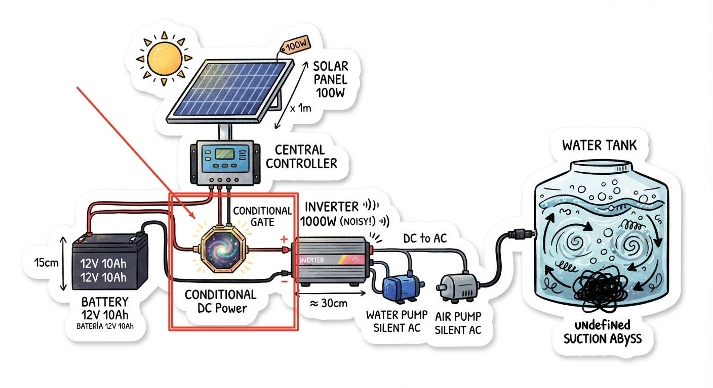
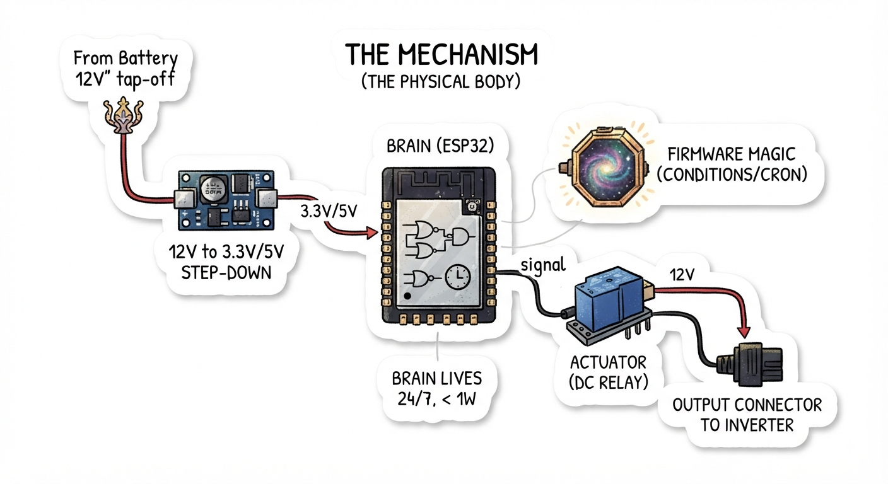

# GATE-12V

**Current Status:** `IDEA -> SEED`

**Next Step:** `TO BE DETERMINED`

**License:** Public domain under **CC0-1.0**.

---

## 1. THE PROBLEM (ROOT)



Solar panel → 12V 10Ah Battery → 120V AC Inverter.

The inverter consumes energy in standby (fan, internal circuits).
The battery cannot sustain 24/7 operation.

**The Question:** How to open the gate only when needed?

**Design Decision:**
The gate is placed on the **Positive (+)** side (high-side switching).
This ensures complete isolation of the inverter when off, eliminating parasitic consumption and providing safety against short circuits to ground. While low-side switching is simpler, it leaves the load energized and creates safety risks in physical installations.

---

## 2. THE SOLUTION (THE ACT)



Install the gate on the **Positive (+)** of the battery.

```
[Battery 12V] --(+)--> [GATE] --(+)--> [Inverter]
              --(-)--> [GATE] --(-)--> [Inverter]
```

The Gate acts as a **High-Side Switch**:
- **Gate closed** → Circuit closed. Energy flows.
- **Gate open** → Circuit broken. Zero consumption. Inverter completely isolated.

---

## 3. THE MECHANISM (THE PHYSICAL BODY)

| Component | Specification | Note |
| :--- | :--- | :--- |
| **Brain** | STM32 or ESP8266 (with WiFi) | Decides when to open. |
| **Actuator** | Relay (DC) | High-side switching of the positive. |
| **Power for Brain** | 12V → Step-down to 3.3V/5V | Brain lives 24/7, consumes < 1W. |

**Initial Logic:**
1. Internal clock.
2. Open at scheduled times.
3. Close at the end of the window.

*(Note: Binary condition "On/Off" is the first step. Future iterations can add sensors, cloud data, or predictive algorithms).*

---

## 4. THE TWO PATHS (BIFURCATION)

| Path | Scheme | Philosophy |
| :--- | :--- | :--- |
| **A (Chosen)** | Cuts the **DC Positive**. Inverter completely off. | Maximum savings. Safety. |
| **B (Discarded)** | Cuts the **AC Neutral** on the output side. Inverter alive but unloaded. | Inefficient. Standby power wasted. |

**Selection:** Path A.

---

## 5. CURRENT STATUS

- **Hardware:** Pending photos and diagrams.
- **Code:** `digitalWrite(RELAY, LOW)`.
- **Next Step:** Upload first connection diagram.

---

## 6. THE MANIFESTO (GOLDEN RULES)

1. The repository is a reflection of the process.
2. Each step is incremental.
3. **Failures are shared.** Every mistake documented here saves someone else from making the same one. This is not a diary; it's a map of what not to do.
4. **This is a seed, not a product.** Fork it. Clone it. Take what works. Leave what doesn't. Build your own gate. The log shows where we started; your fork shows where you take it.


---

## What this is (and what it isn't)

**This is not a product.** There is no warranty, no support, no roadmap.

**This is a seed.** You plant it, you water it, you grow it into whatever solves your problem.

**This is a mirror.** If you see yourself in it, use it. If you see a flaw, fix it. If you see a fork, take it.


---

## Invitation

This is public domain. No permission needed. No credit required.

If you have a problem this solves, use it.
If you see a way to improve it, share it.
If you want to build something else with it, build it.

This is not "my" project. This is "our" project.

---

**End of Manifesto.**

**Next Step:** First wiring.
